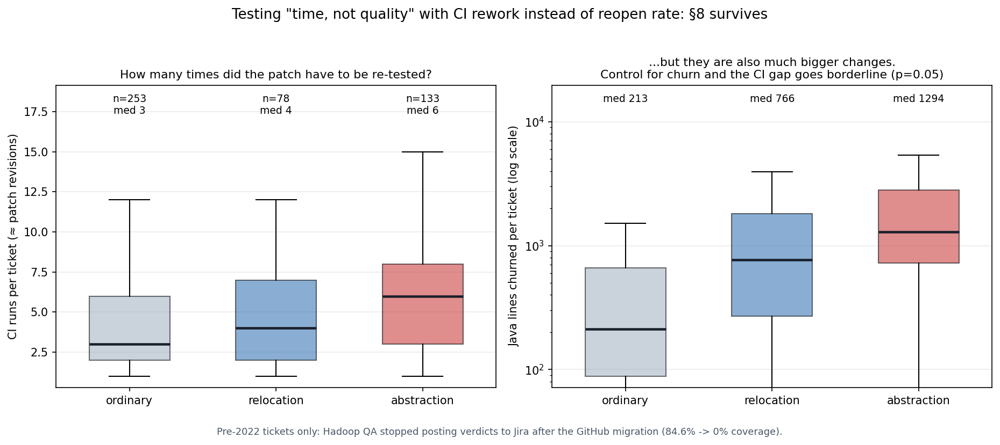
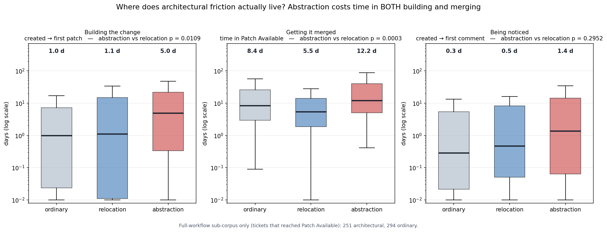
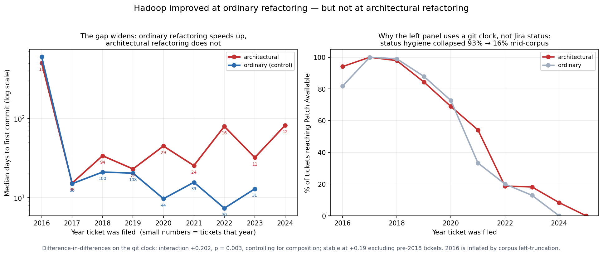
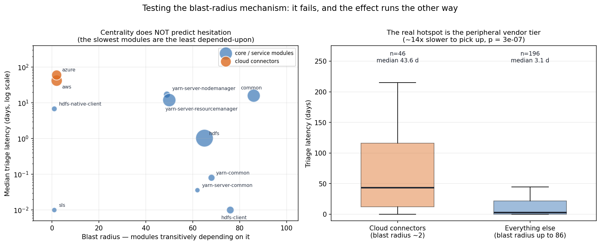

# RQ1 feasibility study — architectural refactoring & review friction in Apache Hadoop

This started as a week-1 "thin slice" starter kit. It grew into a study that established a
reproducible pipeline, ruled out the original signal, produced a defended mechanism-level finding —
and **rejected three competing explanations and corrected one of its own claims along the way.** This
README explains what was done and what was (and wasn't) found; full commands are in
[SLICE_LOG.md](SLICE_LOG.md), the write-up in [research_prospectus.md](research_prospectus.md).

> **Headline finding:** The friction in architectural refactoring is specifically in **creating
> abstractions**, not relocating code. Extracting interfaces/superclasses/classes is **~2.5× slower to
> be picked up** (7.2 vs 2.8 days, p=0.004) and ~2× slower to resolve than moving/renaming code — which
> is itself no harder than ordinary work. The effect **survives controls for change size, discussion
> volume, contributor experience, module tier and era**. Decomposing the Jira status changelog
> localises it: the cost is in **building** the change (~4× longer in logged active coding time), not
> in getting it merged — so it is largely **intrinsic difficulty, not volunteer queueing**. Abstraction
> is the one category that pays twice: harder to build *and* ~2× slower in review (p=0.0003).
>
> **And it is not getting better.** Across the decade, ordinary refactoring got steadily faster while
> architectural refactoring did not improve at all (difference-in-differences interaction **+0.20,
> p=0.003**). A decade of CI and review tooling made routine change cheaper and left structural change
> exactly where it was — architectural debt compounding relative to everything else.


> *(Three candidate mechanisms were tested and **rejected**: a structural-review-discussion signal
> (a discussion-volume confound), the **blast-radius** model (module centrality does not predict
> triage — the association even runs negative), and **maintainer concentration** (collinear with module
> size). An earlier reading of §9 — "friction concentrates in the foundational `hadoop-common`
> module" — was **corrected**: that number was a Jira-prefix aggregate, 62% of it cloud-connector
> tickets. All of this is part of the honest story; see below.)*

---

## What we found

Measured on **8,919 Hadoop commits** (4 release ranges, 3.1.0 → 3.4.3), **349 architectural episodes**:

| Filter (RQ1's chain) | Question | Result | Verdict |
|---|---|---|---|
| **F3** traceability | commit → Jira ticket? | **345/349 = 99%** | ✅ excellent |
| **F1** effort estimate | ticket carries an estimate? | **0/345 = 0%** | ❌ absent in Apache |
| **F2** structural review | review argues about structure? | **31%** (operational) | ⚠️ present, selective |

Four things this study established:

1. **The original framing was wrong.** RQ1 assumed *effort estimates* as the signal. Apache records
   **none** — the field is empty on all 345 tickets ("*no actual time allocated to implement it*").
   No amount of data fixes this; it's a property of the process.
2. **A better signal exists and is minable.** *Structural review discussion* lives on the GitHub PR,
   which Apache's `githubbot` mirrors into the Jira ticket — so it's reachable from the public Jira
   API, no GitHub token. Present in ~31% of episodes (the naive keyword rule says 62%, but a codebook
   check found it only 25% precise — see [codebook_results.md](codebook_results.md)).
3. **Architectural refactorings are measurably higher-friction than ordinary ones, and the friction is
   in *abstraction*.** Vs. a 400-ticket ordinary control, architectural work draws more review and is
   ~2× slower to start and resolve. Splitting it: *relocation* (move/rename) ≈ ordinary work, but
   *abstraction* (extract interface/superclass/class) is ~2.5× slower to be picked up (7.2 vs 2.8 days,
   p=0.004) — surviving controls for size, volume, contributor experience, module tier and era. It's
   **time, not quality** — and that null now survives a far stronger test than the reopen rate:
   using Hadoop's pre-commit CI (runs ≈ patch revisions), architectural tickets need more attempts
   (5 vs 3, p<1e-4), but the effect dies under a change-size control (p=0.07) because those patches
   are simply bigger (1,178 vs 213 java lines churned). Not more error-prone *per unit of code*.

   

   **And the friction is in *building*, not merging.** Splitting the Jira status changelog into phases:
   architectural work takes ~4× longer to produce a patch (3.86 vs 1.00 days) and ~4× longer in logged
   **active coding time** (4.87 vs 1.13 days, p=0.037), yet is merged as fast as ordinary work
   (8.5 vs 8.4 days, n.s.). Active coding time cannot be volunteer queueing — so the effect is largely
   **intrinsic difficulty**, which bounds the open-source caveat instead of just conceding it.
   Abstraction is the one category that pays twice: ~4.5× to build *and* ~2× in review (p=0.0003).

   

   **And across the decade, architectural work is the one category that did not get cheaper.** Using a
   workflow-independent clock (ticket → first citing commit — Jira status hygiene collapsed 93%→16%
   when Hadoop moved to GitHub PRs), ordinary refactoring got steadily faster (rho=−0.21, p=3e-05)
   while architectural refactoring stayed flat (rho=+0.04, p=0.45). Difference-in-differences
   interaction **+0.20, p=0.003**, composition-controlled and stable across truncation windows.

   

   Triage latency also varies ~40× across modules:

   

   Architectural tickets are also **~2× more entangled** (issue-links, p=0.001) — a second,
   volume-independent signal.
4. **Three candidate mechanisms were tested and rejected.** (A fourth claim — that friction
   concentrates in the foundational module — was *corrected* rather than rejected; see the note under
   the headline. The prospectus tabulates all four together.)
   - *Structural review discussion → slower resolution* held under a change-size control (Cox HR 0.69,
     p=0.003) but **collapsed under a discussion-volume control** (HR 1.10, p=0.51).
   - *Blast radius* — the natural reading of the ~40× module spread, that touching a heavily
     depended-upon module invites hesitation — **fails against Hadoop's own Maven dependency graph**
     (117 modules): centrality does not predict triage (p=0.33), and the raw association runs
     *negative*. What is really there is the **opposite**: the structurally peripheral cloud-connector
     tier waits **43.6 vs 3.1 days** (~14×, p=3e-07), with one maintainer owning 33% of its tickets.
   - *Maintainer concentration* — the attempt to replace that hand-drawn tier with a measured social
     variable from git — corroborates it (top author owns 39% of connector commits vs 9%, p=4e-21)
     but **explains nothing**: it is collinear with module size (rho=−0.86) and dies under a size
     control. In one project, "peripheral" is a single variable; separating it needs many projects.

   

**Net:** a defended, mechanism-level finding (abstraction is the locus of refactoring friction, the
cost is in *building* it, and it is the one category not getting cheaper over time), supporting
results (estimates absent; quality unchanged even under a stronger rework test), **three self-rejected
mechanisms and one self-corrected claim**, and a reproducible pipeline. Plus a systemic caveat for
anyone mining Apache Jira: **three independent measurement channels — status comparability, status
hygiene, and CI visibility — all decay at the 2019–20 GitHub migration**, which is why the
decade-spanning claims here are built on git-derived instruments instead. The surviving claim is
small, specific and defended. Full detail: [results_dossier.md](results_dossier.md).

## More figures

(The headline *abstraction gradient* and *module hotspots* charts are shown above; all live in
[figures/](figures/).)

**Scale** — architectural refactoring is rare (349 of 51,861 refactorings):


**Primary comparison** — architectural vs. ordinary refactorings across four measures:


**Rigor** — the retracted finding: significant until discussion volume is controlled, then it crosses
the "no-effect" line:


## What we did (the pipeline)

```
citation probe ─▶ detect refactorings ─▶ filter to architectural episodes ─▶ mine review signal ─▶ survival analysis
   (Filter 3)        (RefactoringMiner)         (Definition 1)                  (F1/F2 per episode)     (Cox / KM)
```

1. **Picked the project by traceability.** `citation_rate.py` — Hadoop cites a Jira key in **92.3%**
   of commits (multi-key: the repo is a monorepo, so a single `HADOOP` key misleadingly reads 26%).
2. **Detected refactorings at scale.** RefactoringMiner is single-threaded, so
   `run_rm_parallel.sh` / `run_rm_safe.sh` split each release range into chunks across 8–16 cores.
   RM hangs on minified-JS dependency bumps; the self-healing runner's watchdog auto-kills and skips
   those (they hold no architectural refactorings). 90–99% coverage per range → **51,861 refactorings**.
3. **Filtered to architectural episodes.** `filter_architectural.py` keeps package-level and
   cross-package refactorings → **349 episodes** (incl. 40 cross-module + Move/Rename/Split Package).
4. **Mined the signals.** `pr_review_signal.py` reads each ticket's review discussion from Jira
   (githubbot PR relay), scoring structural content; a codebook (`codebook.md`) calibrates it.
5. **Ran the analysis.** Cycle-time by F2, Kaplan–Meier + log-rank, then a Cox model controlling for
   change size.

## Reproduce

The `hadoop/` clone and all large outputs are **not** in this repo (see `.gitignore`) — they're
external or regenerable. The committed `*.json` results are the findings; regenerate the rest with:

```bash
# 0    get the corpus (not committed — it's a 1.2 GB upstream clone)
git clone https://github.com/apache/hadoop.git

# 1-2  environment + the decisive traceability probe
bash scripts/setup.sh                      # builds RefactoringMiner + Python venv (JDK 17, Python 3.9)
python3 scripts/citation_rate.py --repo hadoop --key HADOOP,HDFS,YARN,MAPREDUCE

# 3    detect refactorings over a release range (self-healing, uses all cores)
bash scripts/run_rm_safe.sh hadoop rel/release-3.3.0 rel/release-3.4.0 16 150 refminer_wide.json

# 4    filter to architectural episodes (multi-key for the monorepo + Ozone/HDDS)
source .venv/bin/activate
python3 scripts/filter_architectural.py --rm refminer_wide.json --repo hadoop \
  --key HADOOP,HDFS,YARN,MAPREDUCE,HDDS,OZONE,SUBMARINE,YETUS --module-depth 4

# 5    mine the F2 review signal per episode (public Apache Jira, cached)
python3 scripts/pr_review_signal.py --episodes architectural_episodes.json --out review_signal.json

# 6    test the blast-radius mechanism (needs the Jira caches from step 5)
python3 scripts/module_graph.py --repo hadoop        # Maven graph → blast radius per module
python3 scripts/episode_files.py                     # episode → the files its refactorings touched
python3 scripts/blast_radius_model.py                # the mechanism test + figure

# 7    split friction into building vs merging time (status changelog)
python3 scripts/friction_decomposition.py

# 8    social centrality: can a measured variable replace the post-hoc tier? (it cannot)
python3 scripts/social_centrality.py

# 9    decade trajectory: did architectural work share in the project's speedup? (it did not)
python3 scripts/temporal_trend.py

# 10   rework: does architectural work need more patch revisions? (yes, but only because it is bigger)
python3 scripts/ci_rework.py
```

## Key documents

| File | What it is |
|---|---|
| [research_prospectus.md](research_prospectus.md) | **The 2-page write-up** — finding, method, threats, plan |
| [SLICE_LOG.md](SLICE_LOG.md) | Full reproducible run log, every command + the RM-hang saga |
| [worksheet.md](worksheet.md) | The manual 5-episode trace + go/no-go, then the scaled n=345 check |
| [codebook.md](codebook.md) · [codebook_results.md](codebook_results.md) | F2 definition + first-pass labeling (keyword is 25% precise) |
| [codebook_labeling.md](codebook_labeling.md) | 40 real comments to dual-rate (κ) — the open next step |

## Files

```
scripts/
  citation_rate.py          Filter-3 probe: % commits citing an issue key (multi-key)
  setup.sh                  build RefactoringMiner + Python env
  run_refactoringminer.sh   single-threaded RM (original starter)
  run_rm_parallel.sh        N-way parallel RM (tag range → chunks)
  run_rm_safe.sh            self-healing parallel RM (watchdog skips hang-inducing commits)
  rm_skip_range.sh          RM over a range excluding specific commits
  filter_architectural.py   RM output → candidate architectural episodes (multi-key, --all branches)
  pr_review_signal.py       episode → F2 review signal, mined from githubbot's PR relay in Jira
  module_graph.py           Maven poms → module dependency graph + blast radius (117 modules)
  episode_files.py          episode → file paths its architectural refactorings touched
  blast_radius_model.py     the mechanism test (replicates §5 as a gate before reporting anything)
  friction_decomposition.py status changelog → building vs merging vs active time, per group
  social_centrality.py      git → bus factor / concentration (prior-window) + size-confound check
  temporal_trend.py         decade trajectory on a workflow-independent git clock (DiD vs control)
  ci_rework.py              CI runs ≈ patch revisions, with git change-size as the decisive control

data (generated)
  refminer_all.json               51,861 refactorings, 8,919 commits (4 ranges merged)
  architectural_episodes_all.json 349 episodes, 345 traceable
  review_signal_all.json          F2 signal per ticket
  module_blast_radius.json        blast radius + deps per Maven module
  blast_radius_results.json       mechanism test: models, connector tier, §9 decomposition
  friction_decomposition.json     phase split, workflow-comparability check, self-assignment
  social_centrality.json          social measures, size collinearity, the failed replacement test
  temporal_trend.json             decade divergence, workflow-drift + truncation threat checks
  ci_rework.json                  rework counts, size control, the unusable failure-rate measure
  episode_outcomes.json           per-episode cycle-time + F2 + resolved flag
  cox_dataset.json                the survival-model table
  .jira_cache/ .jira_meta/        cached Jira responses (comments; dates/status)
```

## What a full study adds (RQ1 proper)

Validate the codebook with a second rater (Cohen's κ — set is ready in `codebook_labeling.md`),
replace cycle-time with better changelog-derived effort proxies, add covariates + clustering to the
survival model, and replicate on Kafka/HBase/Camel for generality. The public Jira dump (Zenodo
record 15719919) supplies the full changelog history when you scale beyond the live API.
# refactoring-review-friction
