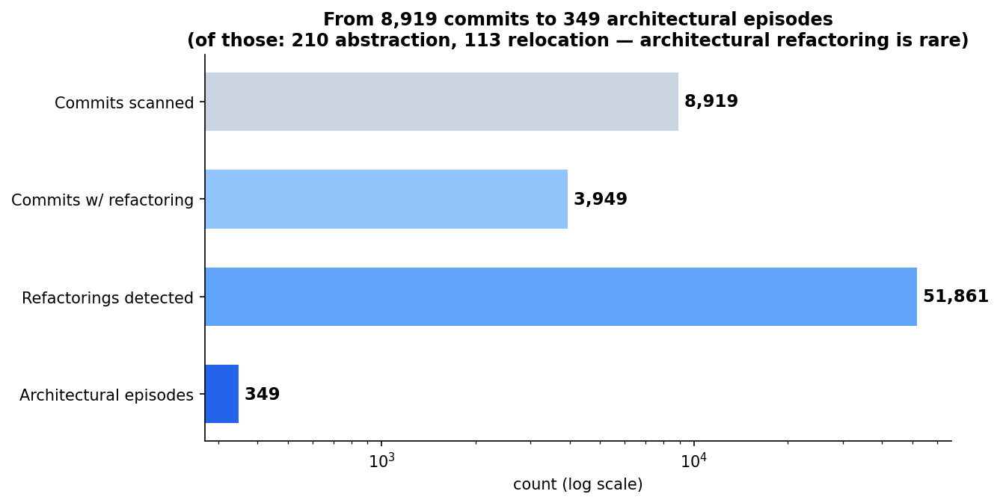
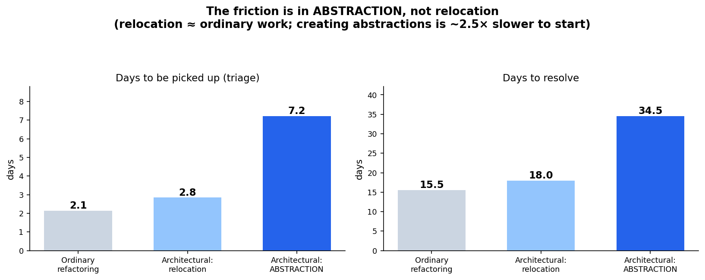
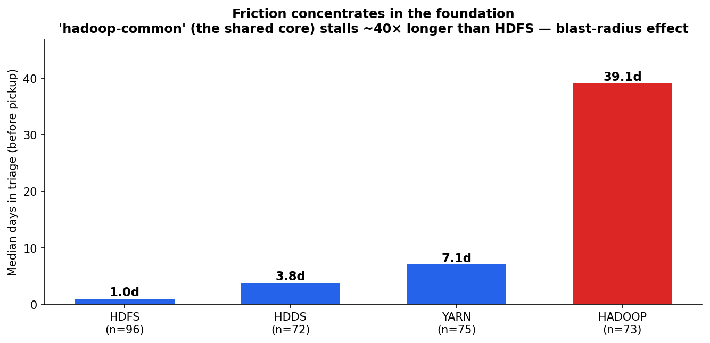
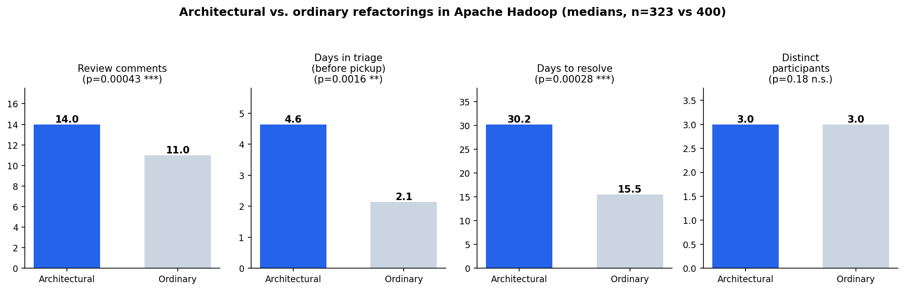
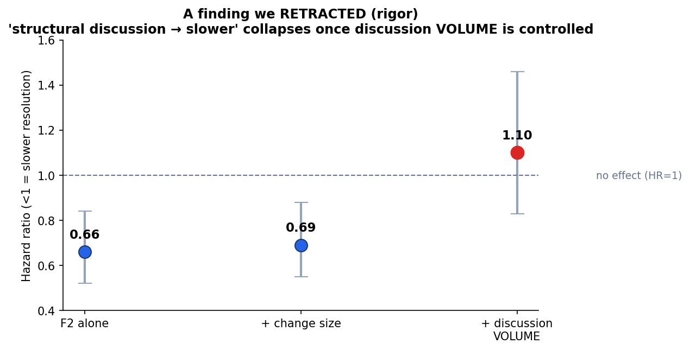

# Preliminary Study Summary — Architectural Refactoring Friction in Apache Hadoop

*Proposal-ready synthesis with figures. Full detail: [results_dossier.md](results_dossier.md);
method + commands: [SLICE_LOG.md](SLICE_LOG.md).*

## 1. Motivation and research question

Large systems accumulate architectural debt, and the refactorings that repay it are believed costlier
and more contentious than routine changes — rarely quantified against real project outcomes. **RQ1:
do architectural refactorings carry measurably more development friction than ordinary changes, and
what is the shape of that friction?** The pilot first rejected the assumption that *effort estimates*
could serve as the signal (absent in Apache), then measured friction from review discussion and
issue-tracker state.

## 2. Method and scale

8,919 Hadoop commits (v3.1.0 → v3.4.3); RefactoringMiner parallelized with a self-healing runner
(90–99% coverage) → 51,861 refactorings → **349 architectural episodes** (323 tickets). Control group:
400 ordinary refactoring tickets. Signals from public Apache Jira: review discussion (githubbot PR
relay), dates, the full status changelog, and ticket properties. Architectural refactoring is rare:

## 3. Feasibility

Traceability **99%** (345/349; needs all monorepo subproject keys — a single-key probe misreads as
26%). Effort estimates **0%** — absent in Apache, ruling out the estimate-based framing.

## 4. Headline finding — the friction is in *abstraction*, not relocation

Architectural refactorings are not uniform. Splitting them by *what they do*:

- **Relocation** (moving/renaming classes and packages) is no harder than ordinary work — triage 2.8
  vs ordinary 2.1 days.
- **Abstraction** (extracting interfaces, superclasses, classes) is **~2.5× slower to be picked up**
  (7.2 vs 2.8 days, p=0.004) and ~2× slower to resolve (34.5 vs 18.0 days, p=0.0001).

The abstraction effect **survives controlling for change size and discussion volume** (p=0.013).
Mechanism: creating a shared abstraction is a larger design commitment → developers hesitate to start.
(Cross-module moves — which are relocations — are actually the *fastest*, confirming that crossing a
boundary is not what makes work hard; the abstraction is.)

**Triage latency is the anchor** because it is measured *before* any discussion, so it cannot be a
discussion-volume artifact.

## 5. Alternatives ruled out

- **Priority:** similar (82% vs 75% Major) — not the cause.
- **Issue type:** architectural work skews to sub-tasks (63% vs 44%), not bugs — controlled for.
- **Discussion volume + change size:** controlled; abstraction survives.
- **Staffing:** architectural work goes to *more active* contributors (median 9 vs 5 tickets,
  p<0.0001) who normally start *faster* (rho −0.19) — yet it still stalls. Not "waiting for a rare
  expert." Under the strictest control (within sub-tasks) the triage gap is borderline (p=0.051):
  robust in direction and magnitude, modest, and — unlike the retracted signal (§8) — it does not
  collapse.

## 6. Supporting findings

- **Entanglement:** architectural tickets link to ~2× more other issues (1.53 vs 0.76, p=0.001, holds
  within sub-tasks). Volume-independent — a second friction dimension.
- **Quality is a null:** reopen rate ~7% across all groups (p=0.97). Abstraction is slower but *not
  buggier* — the friction is time, not error-proneness.
- **Blast radius:** friction concentrates in the foundational module.

Architectural work in `hadoop-common` (the shared core every module depends on) stalls ~40× longer
than in HDFS — the more depended-upon the module, the more hesitation before touching its structure.

## 7. Between-group primary comparison (context for §4)

Architectural vs. ordinary refactorings overall — more review, ~2× longer triage and resolution, same
core of maintainers:

## 8. A finding we retracted (methodological rigor)

A within-episode signal — structural review discussion → slower resolution — looked robust (Cox HR
0.69, p=0.003, survived change-size control) but **collapsed once discussion volume was controlled**
(HR 1.10, p=0.51). Discussion volume is the real predictor; the keyword signal (25% precise) is
entangled with sheer discussion quantity. Reported deliberately.

## 9. Open-source caveat (important)

Much of the timing friction reflects **how open-source coordinates work**: triage latency ≈ "time
until a volunteer opts in," not individual hesitation; estimates absent = Apache culture; the
experience effect = committer gatekeeping. Abstraction-as-commitment and blast-radius are more likely
intrinsic. Generalization beyond OSS is untested — the strongest future step is a commercial-codebase
contrast. This also suggests a reframing: RQ1 may be *"how does a volunteer community ration attention
across high-stakes structural change?"*

## 10. Contribution and full-study plan

**Contribution:** a reproducible fault-tolerant pipeline; a defended, mechanism-level preliminary
finding (abstraction-creation is the locus of refactoring friction — robust to four controls, time-not-
quality, foundation-concentrated); honest negatives (estimates absent, retracted signal); and a
well-scoped design. **Full study:** blast-radius model (module dependency → hesitation); a validated,
dual-rated (κ) structural signal; better changelog effort proxies; a commercial contrast to separate
intrinsic from OSS effects; and replication on Kafka/HBase/Camel.
