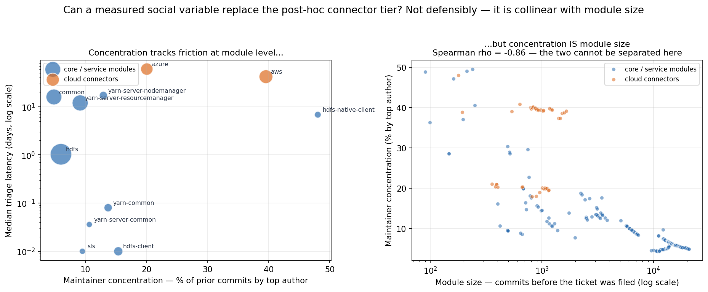

# RQ1 study — full results dossier (for proposal improvement)

*Complete, honest hand-off of everything the preliminary study found. All numbers are exact. This
supersedes earlier partial versions. For an AI agent improving the proposal: the **refined finding
(§5)** is the recommended headline; the **retraction (§10)**, the **refuted blast-radius mechanism
(§9a)** and the **open-source caveat (§12)** are central, not footnotes — do NOT resurrect the
retracted result, do NOT restate §9's original "the foundation stalls" reading (§9a corrects it),
and do not oversell beyond what each number supports.*

Repo: `khannoussi-malek/refactoring-review-friction` (private). Corpus: Apache Hadoop. Independent
pre-PhD pilot to establish feasibility and demonstrate method.

---

## 1. Research question

**RQ1:** Do architectural refactorings carry measurably more development friction than ordinary
changes, and what is the shape of that friction? (Reframed after the original *effort-estimate* signal
proved unusable — see §3.)

## 2. Method

- **Corpus:** 8,919 commits, Hadoop v3.1.0 → v3.4.3 (four release ranges), spanning Mar 2018 – Feb 2026.
- **Detection:** RefactoringMiner, parallelized 8–16× with a self-healing runner that auto-skips
  commits it hangs on (minified-JS bumps); 90–99% coverage. Output: **51,861 refactorings**.
- **Architectural episodes:** package-level + cross-package structural refactorings → **349 episodes**
  (323 unique tickets; some tickets carry >1 architectural commit).
- **Control group:** 400 *ordinary* refactoring tickets for the primary comparison.
- **Signals from public Apache Jira:** review discussion (githubbot PR relay), ticket dates, the full
  **status changelog** (Open→In Progress→Patch Available→Resolved), and ticket properties
  (priority, issue type, components, issue-links, assignee).

**Scale of the pipeline** (architectural refactoring is rare — 349 of 51,861 refactorings):

## 3. Feasibility

- **Traceability 99%** (345/349 episodes cite a Jira key) — but only when every monorepo subproject key
  is matched (HADOOP/HDFS/YARN/MAPREDUCE/HDDS/Ozone/Submarine); a single-key probe misreads it as 26%.
- **Effort estimates 0/323 tickets** — a *deficit*, not an absence. Apache records an estimate on
  2.557% of 1,014,926 issues and the Hadoop corpus on 1.449% of 49,201; the architectural subset
  draws 0 of 323 (expected 4.7, P≈0.009, naive binomial). Architectural tickets are not a random
  draw and the non-randomness could run either way, so this is suggestive on thin evidence. It
  still killed the original framing, because a 1.4% base rate cannot carry an effort-estimate study.

## 4. Primary finding — architectural refactorings are a distinct, higher-friction class

**323 architectural** vs **400 ordinary** refactoring tickets (medians; Mann–Whitney).

| Measure | Architectural | Ordinary | p |
|---|---|---|---|
| Review comments | 14 | 11 | 0.0004 |
| **Triage latency** (days in Open before pickup) | **4.6** | **2.1** | 0.0016 |
| Resolution time (days) | 30.2 | 15.5 | 0.00028 |
| Distinct participants | 3 | 3 | 0.18 (n.s.) |

More discussion, ~2× longer to start, ~2× longer to resolve — same small core of maintainers.
**Triage latency is the anchor against the volume confound** — it is measured *before* any discussion
exists, so it cannot be a discussion-volume artifact (the failure mode that killed §10). That is the
only thing it anchors: §5b and §5c later show triage is *not* trustworthy across module tiers or
across eras, because the Jira status field it derives from is unmaintained for some tiers and
collapsed project-wide at the 2019–20 GitHub migration. Read it as volume-proof, not era-proof.

## 5. Refined finding (RECOMMENDED HEADLINE) — the friction is in *abstraction*, not relocation

Splitting architectural episodes by *what they do*:

| Measure | Relocation-only (move/rename) | **Abstraction (extract interface/superclass/class)** | p |
|---|---|---|---|
| Triage latency (days) | 2.8 | **7.2** | 0.0036 |
| Resolution time (days) | 18.0 | **34.5** | 0.0001 |

**Relocating code is no harder than ordinary work (2.8 vs ordinary 2.1 days); introducing new
abstractions is ~2.5× slower to start and ~2× slower to resolve.**
Mechanism: creating a shared abstraction is a larger design commitment → developers hesitate to start.

**CORRECTED 2026-07-25 — the split is post-hoc and the adjusted effect is borderline.**
Two things must be said with this table, both found by re-testing it properly
(`scripts/full_adjustment.py`, `scripts/advisor_followup.py`):

1. **The abstraction/relocation split was defined *after* seeing the §4 triage numbers** (commit
   `22ec902`, one commit after the §4 result). It is **exploratory** and belongs in a
   pre-registered arm, not in a confirmatory claim.
2. **"Survives five controls" was five *separate nested models* in three scripts, never one
   equation, and no CI was ever reported.** In a single joint model (n=319, HC3):

| Model | abstraction coef [95% CI] | p | ×days |
|---|---|---|---|
| unadjusted | +0.599 [+0.172, +1.026] | 0.006 | ×1.82 |
| + change size | +0.523 [+0.051, +0.996] | 0.030 | ×1.69 |
| + discussion volume | +0.526 [+0.051, +1.001] | 0.030 | ×1.69 |
| + contributor experience | +0.504 [+0.031, +0.977] | 0.037 | ×1.66 |
| + module tier | +0.455 [−0.010, +0.920] | 0.055 | ×1.58 |
| **+ era = FULLY ADJUSTED** | **+0.429 [−0.032, +0.889]** | **0.068** | **×1.54 [0.97, 2.43]** |

It **does not hold at p<0.05 under full adjustment.** It degrades smoothly rather than collapsing
(contrast §10, which went 0.003 → 0.51) and is stable in direction across all six specifications,
but the honest statement is *consistent, underpowered, not established*. VIF max 2.6, so this is
power, not collinearity.

**The split rule itself was too generous, and tightening it does not help.** "Any abstraction-type
refactoring" coded 17% of tickets (53) as abstraction that also contain relocation work. Two
stricter versions:

| Version | n | unadjusted | fully adjusted |
|---|---|---|---|
| pure abstraction vs pure relocation (mixed dropped) | 155 / 112 | +0.660, p=0.004 | +0.404 [−0.076, +0.885], **p=0.099** |
| abstraction as a continuous *share* of the ticket | 319 | +0.638, p=0.006 | +0.436 [−0.026, +0.898], **p=0.065** |

Clustering the SEs changes little: by module (26 groups) p=0.061, by assignee (109 groups) p=0.124.
Note the analysis frame is already one row per **ticket** (349 episodes → 323 tickets aggregated
upstream), so clustering on ticket is a no-op; module and assignee are the dependence that remains.

This also explains an **inverted cross-module result**: cross-module moves (which are *relocations*)
are actually the *fastest* (triage 1.0 day) — so crossing a module boundary is not what makes work
hard; the abstraction is.

## 5a. Phase decomposition — the friction is in BUILDING the change, and it is largely intrinsic

§12's caveat says our timing measures may just be measuring volunteers being slow. The status
changelog settles most of it. Apache's workflow (derived from the corpus, not assumed) is
`Open/Reopened → In Progress → Patch Available → Resolved`, where **Patch Available means working code
exists and is waiting on a committer**. That gives two cleanly separable phases:

- **`t_to_patch`** (created → first Patch Available) = time until working code exists → *doing the work*
- **`t_review`** (total time in Patch Available) = time waiting on a reviewer → *getting it accepted*

**Architectural vs ordinary — the friction is in building, not merging:**

| Phase | Architectural | Ordinary | p |
|---|---|---|---|
| Days to first patch | **3.86** | **1.00** | **0.0020** |
| Days in review | 8.52 | 8.37 | 0.52 (n.s.) |
| Days to first comment | 1.21 | 0.44 | 0.0046 |
| **Active coding time** (In Progress) | **4.87** | **1.13** | **0.037** |

Architectural changes are **~4× slower to produce a patch** and take **~4× longer in logged active
coding time**, but once a patch exists they are **merged just as fast as ordinary work**. Reviewers are
not the bottleneck — building the thing is.

**Abstraction pays twice.** Within architectural work (full-workflow sub-corpus, n=251):

| Phase | Abstraction | Relocation | p |
|---|---|---|---|
| Days to first patch | 4.95 | 1.11 | 0.0087 |
| Days in review | **12.15** | **5.46** | **0.0003** |
| Total lifetime | 30.11 | 13.83 | 0.0017 |

Abstraction is the one category that is slower in **both** phases — ~4.5× slower to build *and* ~2×
slower to get merged (OLS on the clean sub-corpus, connector-controlled: `t_to_patch` +0.51 p=0.032,
`t_review` +0.57 p=0.0025, total +0.63 p=0.0032). Creating a shared abstraction is both harder to do
and harder to get others to accept.

**Why this matters more than any other result here:** active coding time and time-to-build-a-patch are
**not volunteer-queueing artifacts**. A ticket in `In Progress` has someone working on it. So the core
finding is substantially **intrinsic difficulty**, not open-source coordination — which is exactly what
§12 said we could not yet claim. The OSS confound is now **bounded, not merely acknowledged**.

**CORRECTED 2026-07-25 — the phase tables above are unadjusted medians, and adjustment softens them.**
Every number in this section was a Mann-Whitney median comparison. Under the same joint model as §5
(size, discussion volume, experience, tier, era; each phase restricted to the tickets that drive it):

| Phase | median arch/ord | adjusted coef [95% CI] | p |
|---|---|---|---|
| Days to first patch (**BUILD**) | 3.83 / 0.98 | +0.301 [−0.034, +0.636] | 0.078 |
| Days in review (**MERGE**) | 8.46 / 8.15 | +0.014 [−0.221, +0.249] | 0.909 |
| Active coding (In Progress, n=181) | 4.87 / 1.11 | +0.232 [−0.404, +0.868] | 0.475 |
| Total lifetime | 30.13 / 15.30 | +0.046 [−0.204, +0.296] | 0.717 |

**The shape survives, the significance does not.** Build-phase friction is ~3× the merge-phase
coefficient and merge is a clean null, which is the qualitative claim ("reviewers are not the
bottleneck; building is") — but ×1.35 [0.97, 1.89] at p=0.078 is not an established effect. Dropping
the tier dummy, which is 0 by construction for every control ticket and therefore absorbs the slowest
architectural tickets, moves it to +0.316, p=0.062. **This is the most likely headline for a
registered report precisely because it is the one claim that cannot be volunteer queueing — but it
must be pre-registered and re-tested, not reported as established.**

**"Abstraction pays twice" does NOT survive adjustment and is withdrawn as a claim.** Within
architectural work, adjusted: `t_to_patch` +0.327 (p=0.22), `t_review` **+0.107 (p=0.61)**, active
coding −0.144 (p=0.74, n=91). The earlier +0.57 p=0.0025 on `t_review` was connector-controlled only.
The review-phase half of the abstraction cost is **not established**; §12's "abstraction-as-hard-to-
agree-on is social" reading rests on it and must be dropped with it.

**Self-assignment (a strong effect, but read it carefully).** Whether the reporter ends up doing the
work themselves does *not* differ between groups (79.8% architectural vs 78.0% ordinary, p=0.62) — but
it is the largest single predictor of speed we have found: **2.05 days to patch when self-assigned vs
31.66 when not (p < 1e-4)**. This is partly **endogenous** — a ticket that waits for someone else to
take it has, by construction, waited — so it is a description of the mechanism, not a causal estimate.
It says the decisive event in this community is *someone deciding to own the work*.

## 5b. A measurement threat this uncovered — status-derived timings are not comparable across tiers

Decomposing by phase exposed something the aggregate measures hid: **different parts of Hadoop drive
different Jira workflows.**

| Group | Reached `Patch Available` | Used `In Progress` |
|---|---|---|
| Cloud connectors | **28.3%** | 37.0% |
| Everything else | **86.2%** | 27.2% |

A committer who owns a module commits directly and never moves the ticket through `Patch Available`;
the status field simply goes unmaintained while the work happens on a GitHub PR. **This qualifies
§9a:** the connector tier's "43.6-day triage" is closer to a *lifetime* than a measured queue, because
for 72% of those tickets the first status change **is** resolution. Connectors are still genuinely
slower end-to-end (75.2 vs 25.9 days total lifetime, p<1e-4, and 78.9 vs 38.1 days even among tickets
that never reach Patch Available), so the *finding* survives — but the **"waiting for attention"
reading of it does not, and should not be asserted.** Among the 13 connector tickets that do use the
full workflow, review time is 32.2 vs 8.5 days (p=0.19 — directionally 4×, badly underpowered).

**Consequence for the whole study:** every status-derived timing measure — including the triage
latency used in §4, §5 and §9a — must be reported against the **full-workflow sub-corpus**, where the
headline results hold cleanly (tables in §5a). This is a generalisable methodological caveat for
anyone mining Apache Jira, and worth stating as such.

## 5c. Temporal divergence — Hadoop improved at ordinary refactoring, but not at architectural

Every analysis above pools 2016–2026. Splitting by year turns the study from a snapshot into a
trajectory, and the trajectory is the most thesis-shaped result we have.

**The measurement problem had to be solved first.** Hadoop migrated to GitHub pull requests around
2019–2020 and Jira status hygiene collapsed with it: **93.5%** of tickets reached `Patch Available`
before 2019, only **15.5%** after 2022. Every status-derived duration therefore changes meaning
mid-corpus, so the raw "architectural triage is rising" signal (rho=+0.22, p=7e-05) is **substantially
measurement drift and is not reported as a finding.** Restricting to full-workflow tickets does not
rescue it either — that conditions on a variable whose prevalence fell 93%→16%, and leaves only **2.8%**
of the sub-corpus after 2022.

**The fix is a workflow-independent clock:** ticket creation → **the first commit citing it**, read
from git. It means the same thing in 2016 and 2025, and it matches **714/714 tickets (100%)**.

| | Architectural | Ordinary (control) |
|---|---|---|
| Year vs days-to-first-commit | rho = +0.042, p = 0.45 (**flat**) | rho = **−0.209**, p = 3e-05 (**improving**) |

**Difference-in-differences** (the ordinary group is the control — a shrinking or ageing community
would slow *both*):

| Model | Interaction (arch × year) | p |
|---|---|---|
| Plain | +0.278 | <0.001 |
| **+ abstraction & connector composition controls** | **+0.202** | **0.003** |

**Ordinary refactoring got measurably faster over the decade; architectural refactoring did not
benefit at all.** Median days-to-first-commit for ordinary work drifts from ~21 (2018) to ~7–13
(2022–23), while architectural work moves the other way (~34 → ~79). The gap widens from ~1.6× to
~10×.

**CORRECTED 2026-07-25 — it does not hold on post-migration data alone.** The truncation windows below
all still contain pre-2020 data. Restricting to the era after the GitHub migration, on the same git
clock:

| Window | n (ordinary controls) | interaction [95% CI] | p |
|---|---|---|---|
| 2019+ | 424 (253) | +0.192 [+0.029, +0.356] | 0.021 * |
| **2020+** | 239 (145) | **+0.102 [−0.155, +0.360]** | **0.44** |
| **2021+** | 166 (101) | **+0.260 [−0.176, +0.697]** | **0.24** |

The point estimate halves at 2020+ and both CIs are wide. What runs out is the **control arm** — the
ordinary group has <5 tickets after 2023, so the recent era cannot support a difference-in-differences
at all. The divergence therefore **rests substantially on the pre-2020 half of the window**, and the
truncation-window stability below is reassurance about *left truncation*, not about the measurement
break. Report as era-bounded, not as a decade-long trend that continues today.

**Robustness.** The interaction is stable under every truncation window — **+0.202 (2016+), +0.190
(2018+), +0.192 (2019+)**, p<0.05 throughout. The *year main effect* weakens (−0.227 → −0.095 n.s.),
so **"ordinary got absolutely faster" is partly an artifact** of pre-2018 tickets being left-truncated
by our commit corpus (which starts at release 3.1.0, March 2018). **The defensible claim is the
divergence, not the absolute speedup.** The status-based secondary analysis, despite its selection
problem, agrees independently (interaction +0.308, p=0.011).

**Interpretation.** A decade of process investment — CI, GitHub PR review, Yetus automation — made
routine refactoring substantially cheaper and left structural change untouched. That is architectural
debt behaving exactly as the theory says it should: the cost of restructuring does not fall with
ordinary productivity, so it **compounds relative to everything else**. It also reframes RQ1's stakes:
the problem is not that architectural work is slow, but that it is **the one category not getting
better.**

*Caveats.* (a) Right-censoring: tickets that never received a commit are absent, which biases recent
years toward *fast* and therefore makes the divergence **conservative**. (b) The ordinary control has
<5 tickets after 2023, so the last two years rest on the architectural side alone. (c) Days-to-first-
commit is a *total* — it conflates queueing and building, unlike §5a's phase split. (d) Connector share
rises over time (rho=+0.29, p<0.001) and is controlled, but composition and era remain partly
entangled.

## 6. Alternative explanations ruled out

- **Priority:** similar in both groups (Major 82% arch vs 75% ordinary) — not the cause.
- **Issue type:** architectural work is 63% sub-tasks / 11% bugs vs ordinary 44% / 31% — a real
  difference (planned structural work, not bug-driven), *controlled for* in §5.
- **Discussion volume:** controlled (§5); abstraction survives.
- **Contributor experience / staffing:** architectural work goes to *more active* contributors
  (assignee handled median 9 vs 5 of our tickets, p<0.0001), and more-active contributors have
  *shorter* triage (rho −0.19, p=0.001). So the delay is **not** "waiting for a rare expert" — capable
  people own this work and it *still* stalls. Rules out the staffing objection.
- **Strictest control** (triage within sub-tasks only): borderline, 6.0 vs 2.1 days, p=0.051 — the
  effect is robust in direction/magnitude but modest under the tightest control. Honest verdict: real,
  consistent, not a slam dunk; does NOT collapse the way the retracted signal did.

## 7. Second, volume-independent finding — entanglement

Architectural tickets link to ~2× more other issues (issue-links mean **1.53 vs 0.76, p = 0.001**),
and this **holds within sub-tasks** (1.55 vs 0.73, p=0.003). Issue-links are a structural ticket
property, not built from discussion → immune to the volume confound. Architectural changes are more
tangled into the surrounding web of work.

## 8. Outcome quality — a clean NULL (informative)

Rework does **not** differ: reopen rate ~7% across ordinary / relocation / abstraction (p=0.97);
review rounds 0.97 / 1.04 / 1.39 (p=0.79). **Abstraction work is slower but not buggier** — the
friction is time/effort, not error-proneness. (Note: our sample is survivorship-biased toward changes
that landed, so *abandonment* is not measurable here.)

## 8a. Re-testing "time, not quality" with CI rework — §8 survives a much stronger test

§8's null rests on the **reopen rate** (~7%, p=0.97), which is a blunt instrument: reopening is rare,
happens long after the fact, and says nothing about how much a change had to be *fixed before it
landed*. Hadoop's pre-commit CI gives a far better measure — every posted patch triggers a Hadoop QA
run, so **number of CI runs ≈ number of patch revisions**. Median 5 runs per ticket, max 45.

| | Ordinary | Relocation | Abstraction |
|---|---|---|---|
| Median CI runs | 3 | 4 | **6** |
| Median java lines churned | 213 | 766 | **1294** |

Architectural tickets need **more CI attempts (5 vs 3, p<1e-4)**, and unlike §10 that is **not**
discussion volume in disguise — it survives a human-comment-count control (+0.181, p<0.001).

**But it does not survive change size.** Architectural changes are simply far bigger — **1,178 vs 213
java lines churned (p=5e-28)**, 20 vs 8 files — and a bigger patch trips more checkers:

| Model | `arch` coefficient | p |
|---|---|---|
| Raw | +0.250 | <0.001 |
| + human comment volume | +0.181 | <0.001 |
| **+ change size (files, churn)** | **+0.092** | **0.072** |
| + change size + era | +0.100 | 0.051 |

**Verdict: §8 substantially survives.** The extra rework is mostly *bigger patches*, not
architectural-ness as such — the residual is borderline (p≈0.05–0.07), consistent in direction but not
established. The honest refinement of §8 is: architectural work is not more error-prone *per unit of
code changed*; it simply involves more code.

**A measure that did not work, recorded so it is not retried.** The failure *rate* (failed runs ÷ total
runs) looked like the ideal volume-independent metric, but `-1 overall` fires on **any** warning —
checkstyle, javadoc, one flaky unrelated test — so **86.7% of all runs "fail"** and both group medians
sit at 100%. It is pinned against its ceiling and carries no usable signal.

*Caveat — a third decaying instrument.* CI verdicts stop appearing in Jira after the GitHub migration:
**84.6% of pre-2019 tickets carry them, 0% after 2022.** This analysis is therefore about the
pre-2022 era only. That is now three independent measurement channels (Jira status §5b, status
hygiene over time §5c, CI visibility here) that decay at the same migration — a systemic caveat for
Apache-Jira mining, not three coincidences.

## 9. Module hotspots — large variation, but NOT where we first thought

Median triage latency by top-level Jira project (architectural tickets):

| Jira project | Arch tickets | % abstraction | Median triage |
|---|---|---|---|
| HDFS | 96 | 56% | **1.0 day** |
| HDDS (Ozone) | 72 | 60% | 3.8 days |
| YARN | 75 | 77% | 7.1 days |
| **HADOOP** | 73 | 68% | **39.1 days** |

**~40× variation** — this part stands. Our original interpretation of it (**blast radius**: the more
depended-upon a module, the more hesitation before touching its structure) was **tested in §9a and
does not survive.** Two things were wrong with reading the table above as a blast-radius result:

1. `HADOOP-*` is a **Jira project prefix, not a module.** It bundles `hadoop-common` with every
   cloud-connector ticket (`hadoop-aws`, `hadoop-azure`, …), which live under `hadoop-tools/`.
2. Those connectors, not the foundation, are what makes the row slow.

## 9a. Testing the blast-radius mechanism — it fails, and the effect runs the other way

We measured module centrality **independently of the tickets**, from Hadoop's Maven dependency graph:
117 in-tree modules, 513 internal edges; a module's **blast radius** = how many modules transitively
depend on it (range 0–90; `hadoop-common` = 86, `hadoop-aws`/`hadoop-azure` = 2). Architectural
episodes were mapped to modules via the *file paths of the architectural refactorings themselves*
(from RefactoringMiner, not the whole commit diff). **259/349 episodes → 242 tickets with triage.**

**The mechanism is refuted:**

| Test | Result |
|---|---|
| Blast radius vs triage, ticket level (n=242) | rho = **−0.19**, p = 0.003 — *negative*: more central = picked up **faster** |
| Blast radius vs median triage, module level (n=11) | rho = −0.18, p = 0.59 (n.s.) |
| OLS + connector-tier control | coef **+0.09, p = 0.33 — null** |
| Spearman excluding connectors (n=196) | rho = **−0.03, p = 0.65 — null** |

Once the cloud-connector tier is controlled for, blast radius carries **no signal at all**. The
apparent negative correlation was entirely the connectors (peripheral *and* slow) pulling the line.

**The real hotspot is the peripheral vendor tier:**

| Group | n | Median triage | Median blast radius |
|---|---|---|---|
| Cloud connectors (`hadoop-aws`, `hadoop-azure`, …) | 46 | **43.6 days** | 2 |
| Everything else (incl. `hadoop-common`, HDFS, YARN) | 196 | **3.1 days** | 65 |

**~14× slower, p = 2.7e-07.** It is not an era artifact — connectors are slower in every period
(≤2018: 15.2 vs 2.2 d; 2019–21: 25.7 vs 2.9 d; 2022+: 72.5 vs 20.7 d), and the tier survives a
year control (coef +1.67, p = 0.0001).

**Correcting §9's headline number:** the 39.1-day `HADOOP-*` median reproduces exactly, but **45 of
those 73 tickets (62%) are cloud connectors, not `hadoop-common`.** `hadoop-common` on its own is
**n = 25, median 24.8 days** — still elevated, but the "foundation stalls ~40× longer than HDFS"
claim was inflated by a project-prefix aggregation.

**Why are connectors slow?** Not a thinner volunteer pool — tickets per assignee is the same
(2.56 vs 2.36). It is **concentration**: one maintainer owns **33%** of connector tickets versus 9%
for the top maintainer elsewhere. Work waits on a specific person, not on collective nerve.

**What this means (feeds §12).** Friction does *not* track where technical risk is highest; it tracks
where **community attention is thinnest**. Vendor-specific connectors are structurally safe to change
and still wait ~6 weeks, while the module 86 others depend on is picked up in days. That is attention
rationing, not blast-radius hesitation — direct empirical support for the §12 reframing.

**§5 survives this, strengthened:** with connector tier and era both controlled, abstraction still
predicts triage (coef **+0.67, p = 0.010**), and it holds even with connectors excluded entirely
(coef +0.59, p = 0.041). The headline finding now holds under all five controls: change size,
discussion volume, contributor experience, module tier, and era.

*Caveats.* (a) **90 episodes (26%) could not be attributed** — 78 are HDDS/Ozone and 2 Submarine,
subprojects since split out of the Hadoop repo, so their poms no longer exist in-tree; this analysis
covers the surviving monorepo only. (b) The dependency graph is a **present-day snapshot** applied to
episodes spanning 2016–2026. (c) Module-level n = 11 is small. (d) The connector tier was **found by
inspecting the module table, not hypothesized in advance** — it needs confirmation on a held-out
project before being treated as a claim rather than a lead.

## 9b. Social centrality — corroborates the tier, but fails to explain it

§9a's weakest point was its own admission: the connector tier was **hand-drawn from seven module names
spotted in a table**. §5b then showed its timing numbers are partly a workflow artifact. So we tried to
replace the post-hoc dummy with a continuous, independently measured variable — **maintainer
concentration**, computed from **git** (a different data source from the Jira assignee figures) over
commits **strictly before each ticket was filed**, so the ticket's own work cannot inflate the
predictor.

**What worked — independent corroboration of the tier's character:**

| Measure (median) | Connectors | Rest | p |
|---|---|---|---|
| Top author's share of prior commits | **39%** | 9% | 4e-21 |
| Bus factor (authors covering 50% of commits) | **3** | 10 | 2e-19 |
| Distinct authors | 76 | 124 | 9e-11 |
| Reviewer pool (commenters on the module's other tickets) | 26 | 39 | 1e-04 |

Git independently confirms what Jira assignees suggested: these modules really are owned by very few
people. That is a solid *description*.

**What failed — it does not explain friction.** Concentration is **near-collinear with module size**
(Spearman **−0.86**, p=4e-69): a module maintained by few people is almost tautologically a module with
few commits. Once module size is controlled, the effect collapses on exactly the measures §5b showed
are trustworthy:

| Outcome | Concentration alone | + module-size control |
|---|---|---|
| `t_to_patch` (building) | +3.27, p = 0.024 | +3.51, **p = 0.239** |
| Total lifetime | +2.98, p < 0.001 | +2.38, **p = 0.073** |
| Triage latency | +4.51, p < 0.001 | +7.13, p < 0.001 |

Only **triage** survives — and triage is precisely the measure §5b showed is contaminated for these
tickets (unmaintained status field ⇒ triage ≈ lifetime). Worse, concentration produces **no gradient
at all within the non-connector corpus** (triage rho = −0.05 p=0.50; `t_to_patch` rho = +0.09 p=0.27;
total rho = +0.08 p=0.25).

**Verdict: the replacement attempt fails.** Maintainer concentration does not defensibly substitute for
the post-hoc tier, so **§9a caveat (d) stands** — the connector finding still needs a held-out project.

**What we learned anyway (the useful part).** In this corpus, "peripheral module" is a **single latent
property**: small, few-authored, low-centrality and vendor-specific all travel together and cannot be
separated with 11 modules. That is a concrete design requirement for the next study rather than a
vague call for more data: **breaking this collinearity needs many more modules — i.e. multiple
projects — and is a precondition for any causal claim about attention.**

## 9c. A portable tier rule that works — "does this module wrap an external system?"

§9a's tier was drawn by hand from seven module names in a results table, and §9b failed to replace it
with maintainer concentration. Neither can be carried to Kafka. What Hadoop's slow modules actually
share is that they **wrap an external service API** — which is a project-independent property (Kafka
has Connect, Camel is almost nothing but connectors). The operationalisation must avoid a hand-written
vendor list, or the hand-drawing has just moved.

**The rule** (`scripts/external_wrapper_tier.py`), computed from `pom.xml` alone, before any outcome
data:

> A third-party groupId is **rare** if at most τ of the project's own modules declare it. A module's
> **vendor share** is the fraction of its declared dependencies that are rare third-party groupIds.
> A module is an **external-system wrapper** if its vendor share ≥ 0.40.

Shared infrastructure (guava, slf4j, junit) is common by construction and drops out automatically; a
vendor SDK pulled in by one or two modules is what the rule fires on. Both parameters are
pre-registerable and need no knowledge of the project.

**Two failed versions are recorded so they are not retried.** (a) *Count* of rare dependencies rather
than share: flags 15 of 25 modules, because a hub accumulates rare dependencies simply by being large.
(b) *Ignoring dependency scope*: flags 18 of 25, because test-only helpers (logback, hsqldb,
mock-server) are rare by nature. Restricting to compile/runtime scope and switching from count to
share is what makes it work.

| Rule (τ=0.05) | modules flagged | precision vs hand tier | recall | median triage: wrapper vs rest |
|---|---|---|---|---|
| vendor share ≥ 0.15 | 14 | 0.21 | 1.00 | 14.9 vs 1.2 d (p=6e-05) |
| vendor share ≥ 0.25 | 10 | 0.30 | 1.00 | 17.4 vs 2.9 d (p=5e-04) |
| **vendor share ≥ 0.40** | **6** | **0.50** | **1.00** | **32.1 vs 2.9 d (p=3.4e-07)** |
| *hand-drawn tier (reference)* | *7* | *1.00* | *1.00* | *43.6 vs 3.1 d (p=2.7e-07)* |

**It reproduces the tier effect at comparable strength with no hand-drawing.** The continuous version
needs no threshold at all: vendor share vs triage, rho = **+0.371, p < 1e-4** (n=242).

**And it survives the control that killed §9b.** Vendor share is only mildly related to module size
(rho = −0.38, against the **−0.86** that made maintainer concentration inseparable from "small"):

| Model | vendor-share coef [95% CI] | p |
|---|---|---|
| alone (+ abstraction) | +3.158 [+2.018, +4.299] | <1e-4 |
| + module size | +3.135 [+1.949, +4.321] | <1e-4 |
| + module size + era | **+2.885 [+1.571, +4.199]** | **<1e-4** |

**This is the first tier measure in the study that is both portable and not a proxy for module size.**

> ### ⚠ REPLICATION RESULT (2026-07-25): the rule does NOT hold out. 0 of 3 projects.
>
> Predictions were pre-registered (`predictions/PREDICTIONS.md`, commit `ca076a9`) before any
> outcome data was pulled, then tested on held-out Apache projects. Full write-up:
> `replication/REPLICATION.md`.
>
> | Project | modules (flagged/not) | flagged median | unflagged | p |
> |---|---|---|---|---|
> | Hive | 40 (6/34) | 12.7 d | 7.8 d | 0.210 |
> | Drill | 17 (2/15) | 8.8 d | **9.7 d** (wrong direction) | 1.000 |
> | Kylin | 15 (5/10) | 6.2 d | 5.9 d | 0.310 |
>
> Two further projects (**HBase, Phoenix**) produced **no prediction at all** — the frozen 0.40
> vendor-share cut never fires on them (HBase's maximum is 0.33). Flink was dropped at 66%
> traceability. So the rule's *coverage* is 3 of 5, and its *accuracy* on those 3 is nil.
>
> **Two things this does not mean.** (a) It does not refute the tier *concept*: in both large
> projects the slowest modules are external-system connectors — `hive-accumulo-handler`,
> `hive-jdbc`, `kafka-handler`, `drill-mongo-storage`, `drill-storage-kafka` — and the rule flagged
> **none** of them, selecting the core engines (`drill-java-exec`, `hive-exec`) instead. The
> operationalisation fails; the concept is untested. (b) The pre-registered test is itself
> near-useless: run on **Hadoop**, where the separation is 51.1 vs 6.5 days, it still gives
> **p=0.133**, because 2-vs-4 modules cannot produce a smaller two-sided Mann-Whitney p-value at
> any effect size.
>
> **Consequence for §15:** the breadth requirement is not specific to the abstraction question.
> Module-level tier tests need many projects for the same reason ticket-level ones do.

*Caveats.* (a) Precision is 0.50 because only **3** hand-tier modules carry architectural tickets, so
the agreement statistic rests on three positives and means very little — the triage split and the size
control are the real evidence. (b) The three "false positives" are arguable: `hadoop-yarn-csi` (gRPC
to external storage plugins) and `hadoop-yarn-server-common` (external SQL Server state store) are
external-system wrappers on any reading; `hadoop-common` is a genuine miss and the reason the rule
needs a size or centrality guard before use. (c) **This is still Hadoop**, where the target was drawn:
reproducing it here is a necessary condition, not evidence of generality. The rule must be **fixed in
advance** and tested on Kafka/HBase/Camel.

**Separability check for §5 (`advisor_followup.py` step 3).** Abstraction is not confounded with the
tier: abstraction is 74% of connector tickets vs 64% elsewhere (Fisher OR=1.63, **p=0.19**), so the
joint model is identified. Cell medians (days): relocation/non-tier **1.1**, abstraction/non-tier
**4.2**, relocation/tier **8.0**, abstraction/tier **49.0** — but the last-but-one cell has n=12, so
the apparent interaction cannot be tested here.

## 10. Retracted result — a within-episode signal that was a volume confound

We tested whether, *among* architectural episodes, more *structural review discussion* predicts slower
resolution.

Apparent effect (Cox HR 0.69, p=0.003, robust to change size) **collapsed** when
discussion volume was added (HR **1.10, p=0.51**). Discussion volume is the real predictor (HR 0.70
per log-comment, p≈1e-9); structural *density* is null (p=0.26). Reported deliberately — catching this
before it became a claim is part of the contribution.

## 11. Measurement validity — the keyword signal is weak

First-pass codebook labeling (single rater) of 40 comments: keyword **precision ≈ 25%** for
"structural" (5/20 flagged comments genuinely structural), miss ≈ 5%. The naive 62% "structural
review" rate is inflated; a validated, dual-rated (κ) classifier is needed to use this signal.

## 12. Open-source context — threat to validity AND a reframing (IMPORTANT)

*Substantially revised after §5a: the phase decomposition converts much of this from "unbounded
threat" to "measured and bounded."*

Some of the measured "friction" still reflects **how open-source coordinates work**:
- **Low estimate use** is an Apache-culture artifact (no managerial planning), not a property of
  software — and it is per-project, not Apache-wide: MESOS 32.94%, STDCXX 38.70%, USERGRID 37.51%
  against 2.557% overall.
- **Experience finding** reflects OSS **committer gatekeeping** (trust/permission), not just skill.
- **Self-assignment** (§5a) is the clearest OSS-specific mechanism: the decisive event is someone
  choosing to own the work (2.05 vs 31.66 days to patch). A firm with assigned owners has no
  equivalent.
- **§9a's connector tier** cannot be read as an attention effect, because those tickets do not drive
  the workflow that would make "waiting" measurable (§5b).

**The core finding is probably not a coordination artifact, but this is now weaker than it was.** §5a
shows architectural work takes ~4× longer in **logged active coding time** (4.87 vs 1.13 days) and ~4×
longer to **produce a patch**, while being merged just as fast as ordinary work. Time spent
`In Progress` is time somebody is working — it cannot be volunteer queueing. **CORRECTED 2026-07-25:**
under full adjustment the build-phase gap is ×1.35, p=0.078 and the active-coding gap is p=0.475
(n=181), so the *direction* of the bound holds and its *strength* does not. Read §12 as "the OSS
confound is bounded in principle and the bound is not yet measured tightly."

Also withdrawn: abstraction's ~2× review cost (12.15 vs 5.46 days) does not survive adjustment
(p=0.61), so the **social half of the split below has no evidence behind it.**

So the honest split is: **abstraction-as-difficulty is intrinsic and should replicate in industry;
abstraction-as-hard-to-agree-on is untested, not supported; who-picks-it-up is purely OSS.**

**Reframing opportunity:** RQ1 may be less "do individuals hesitate?" and more **"how does a
volunteer community ration attention across high-stakes structural change?"** — a novel, legitimate
framing. To separate intrinsic from OSS-specific effects, the strongest future step is contrasting
with a **commercial/industrial codebase** (all-OSS replication tests OSS-generality only).

## 13. What is / isn't established

> **REVISED 2026-07-25 after the full-adjustment pass.** Three items below moved from *established*
> to *consistent but underpowered*: the abstraction effect (§5), the build-vs-merge localisation
> (§5a), and the decade divergence in the recent era (§5c). One item — "abstraction pays twice" —
> is withdrawn outright. One item was added: a portable tier rule (§9c). The pattern is uniform:
> **unadjusted differences are large and adjusted ones are directionally identical but sit at
> p≈0.06–0.10 on ~250–320 tickets.** This is a power problem, and §15 now quantifies it.

**Established:** (a) architectural refactorings are a distinct, higher-friction class (§4); (b) the
friction is specifically in **abstraction-creation, not relocation** (§5) — *unadjusted*; under full
joint adjustment ×1.54 [0.97, 2.43], p=0.068, so **consistent, not established**; (c) the friction is
in building the change, not in getting it merged (§5a) — merge is a clean null (p=0.91) and build is
×1.35 [0.97, 1.89], p=0.078, so the **shape** is established and the magnitude is not; (d) *[withdrawn
— see below]*; (e) architectural tickets are ~2× more **entangled** (§7); (f) friction is
**time, not quality** (§8) — and this now survives a far stronger rework test than the reopen rate:
architectural work needs more CI attempts only because it is bigger, not because it is more
error-prone per unit of code (§8a); (g) friction varies ~40× across modules (§9), concentrated in the
peripheral vendor tier rather than the foundation (§9a), and that tier is now reproducible from a
**portable, pre-registerable rule** that survives the module-size control (§9c); (h) architectural
refactoring did not share in the decade of process improvement that made ordinary refactoring faster
(§5c) — **but only up to ~2019**: post-2020 the control arm is too thin to test (p=0.44), so this is
era-bounded; (i) estimates absent; traceability excellent.

**Refuted by our own tests:** the **blast-radius mechanism** (§9a) — module dependency centrality does
not predict triage latency (p = 0.33 with tier controlled), and the raw association runs *negative*.

**Withdrawn 2026-07-25:** **"abstraction pays twice"** (§5a) — the ~2× review-phase cost (12.15 vs
5.46 days) does not survive full adjustment (+0.107, p=0.61). It was connector-controlled only.

**Qualified by our own tests:** §9a's connector tier is slower end-to-end but its "waiting for
attention" interpretation is not supported — those tickets do not drive the Jira workflow that would
make waiting measurable (§5b).

**Tested and failed to establish:** **maintainer concentration** as a measured replacement for the
post-hoc connector tier (§9b) — it corroborates the tier's character from git but is collinear with
module size (rho −0.86) and explains nothing once size is controlled.

**Not established:** whether *structural review discussion as such* adds friction beyond volume (§10 —
untested, not disproven, needs validated signal); whether any attention-based explanation for the
connector tier holds (§9a/§9b — still post-hoc, needs a held-out project); whether the
**self-assignment** effect is causal rather than definitional (§5a — endogenous); whether the
*review-phase* half of the abstraction cost generalizes **beyond open-source** (§12 — the
*build-phase* half now plausibly does); causal direction.

## 14. Threats to validity

Descriptive/associational; single project (Hadoop), single release-line window; groups not fully
matched (module/time); triage-within-sub-tasks borderline (p=0.051); keyword signal 25% precise, no κ;
survivorship bias toward landed changes; **three independent measurement channels decay at the
2019–20 GitHub migration** (Jira status comparability §5b, status hygiene over time §5c, CI verdict
visibility §8a) — so several results are necessarily era-bounded; the **open-source coordination
confound (§12)**, now bounded
by §5a rather than open-ended; **status-derived timings are not comparable across module tiers that
drive different workflows (§5b)** — results should be read on the full-workflow sub-corpus; the
self-assignment effect is **endogenous** (§5a); `In Progress` is logged by only ~25% of tickets, so
active-time results rest on that sub-corpus; and for §9a specifically, **26% episode attrition**
(Ozone/Submarine left the repo), a present-day dependency snapshot applied to a decade of history, and
a **post-hoc** connector tier.

## 15. Open questions / directions

0. **POWER IS NOW THE BINDING CONSTRAINT — and the answer is more projects, not more commits.**
   (`advisor_followup.py` step 8.) Anchoring on the fully adjusted pure-split effect (coef +0.404,
   SE 0.245, n=267), 80% power needs **~769 independent architectural tickets** — ~21,000 commits at
   Hadoop's yield of one episode per 26 commits. But tickets inside one project are not independent.
   With P projects and intra-project correlation ICC, effective n is capped at **P/ICC no matter how
   much is mined**:

   | ICC | P=3 | P=5 | P=10 | P=20 | P=40 |
   |---|---|---|---|---|---|
   | 0.02 | ceiling 150 | 250 | 500 | 1000 → 163 tickets each | 2000 → 31 each |
   | 0.05 | ceiling 60 | 100 | 200 | 400 | 800 → 472 each |

   **Kafka + HBase + Camel cannot reach 80% power at any corpus size.** The registered report needs
   **~10–20 projects contributing modest numbers of episodes**, not three deeply-mined ones. This is
   the same conclusion §9b reached from the module side, arrived at independently.
1. ~~**Blast-radius model**~~ (**§9a: no**) → ~~**attention-rationing model** via maintainer
   concentration~~ (**§9b: not separable from module size**) → **§9c: the external-wrapper vendor-share
   rule works** — portable, computed from `pom.xml` before any outcome data, reproduces the tier split
   (32.1 vs 2.9 days) and survives the size control that killed §9b (+2.885, p<1e-4). **Pre-register it
   and test it on the held-out projects.** The remaining collinearity worry stands: peripherality, size
   and author count are still one variable *within* a project, and only breadth separates them.
2. **Validated structural signal** (dual-rater κ), then re-test §10.
3. **Commercial contrast** to separate intrinsic vs OSS-coordination effects (§12).
4. ~~**Better effort proxies** from the changelog (active vs waiting time)~~ **Done in §5a**;
   ~~rework~~ **done in §8a via CI runs.** Follow-on: reverts and follow-up-fix commits (the one
   rework channel that does *not* decay at the GitHub migration, since it lives in git), and
   recovering active time for the ~75% of tickets that never log `In Progress`
   (GitHub PR timestamps via the githubbot relay would give a workflow-independent clock — and would
   also repair the §5b comparability problem).
5. **Replicate** on Kafka/HBase/Camel — now with a **specific pre-registered prediction** from §9a
   (peripheral/vendor-integration modules should show longer triage than core modules) *and* the
   design requirement from §9b (enough modules to separate size from concentration).
6. Human-factors (RQ2): who takes on architectural work, and why *peripheral* work stalls.
7. **Recover the Ozone/Submarine episodes** (§9a caveat a) by resolving their split-out repos.

## 16. Reusable assets

Fault-tolerant parallel refactoring-mining pipeline (`scripts/run_rm_safe.sh`); PR-review recovery
from Jira via bot-relay (no GitHub token); monorepo-aware traceability probe; status-changelog method
separating waiting from active work; **Maven blast-radius graph builder** (`scripts/module_graph.py`)
and **refactoring→module attribution + mechanism test** (`scripts/episode_files.py`,
`scripts/blast_radius_model.py`, which reruns the §5 replication gate before reporting anything);
**CI-rework mining** (`scripts/ci_rework.py` — patch-revision counts from pre-commit bot verdicts,
with per-ticket change size recovered from git as the decisive control);
**workflow-independent timing clock** (`scripts/temporal_trend.py` — ticket→first-citing-commit from
git, which survives the 2019–20 collapse in Jira status hygiene that breaks every status-derived
duration, plus the drift/composition/truncation threat checks around it);
**status-changelog phase decomposition** (`scripts/friction_decomposition.py`) separating *building*
from *merging* time, with a built-in workflow-comparability check (§5b) that other Apache-Jira studies
would need; **prior-window social-centrality measures** (`scripts/social_centrality.py` — bus factor,
concentration and reviewer pool computed only over history preceding each ticket, with the size-
collinearity check that decides whether they mean anything);
**single-equation full adjustment with CIs** (`scripts/full_adjustment.py` — the joint model and the
post-migration era cut, replacing five nested models spread across three scripts);
**split-robustness, phase adjustment, clustered SEs and the power model** (`scripts/advisor_followup.py`
— including the project-count ceiling `n_eff ≤ P/ICC` that decides corpus design);
**portable module-tier rule** (`scripts/external_wrapper_tier.py` — vendor-share from `pom.xml`,
computable before any outcome data, with the size-collinearity control that killed its predecessor);
committed data artifacts (`*_all.json`, `cox_dataset.json`, `episode_outcomes.json`,
`arch_vs_ordinary.json`, `module_blast_radius.json`, `blast_radius_results.json`,
`friction_decomposition.json`) and the charts.

## 17. Honest abstract

> On 8,919 Apache Hadoop commits (v3.1.0–v3.4.3) we detected 349 architectural refactoring episodes,
> 99% traceable to Jira. Against 400 ordinary refactoring tickets, architectural ones draw more review
> and take ~2× longer to start and resolve. The friction concentrates in **abstraction-creating**
> refactorings (extract interface/superclass/class): ~2.5× longer triage than code relocation
> (p=0.004 unadjusted), while simple relocation is no harder than ordinary work. Under a **single
> fully-adjusted model** — change size, discussion volume, contributor experience, module tier and era
> in one equation — the effect is **×1.54 [0.97, 2.43], p=0.068**: directionally stable across every
> specification but **underpowered rather than established**, and the split was defined post-hoc. The
> effect is **time, not quality** (no extra rework).
> Decomposing the status changelog into phases localises it: architectural work takes ~4× longer in
> logged active coding time (4.87 vs 1.13 days) and ~4× longer to produce a patch, but is **merged as
> fast as ordinary work** — adjusted, review is a clean null (p=0.91) and the build gap is ×1.35
> (p=0.078). So what friction exists is **construction, not review**, which bounds the volunteer-
> queueing confound in principle even though the bound is not yet measured tightly.
> Tracked across a decade with a workflow-independent clock (ticket → first citing commit, since Jira
> status hygiene collapsed 93%→16% mid-corpus), **ordinary refactoring got steadily faster while
> architectural refactoring did not improve at all** — a widening divergence (difference-in-differences
> interaction +0.20, p=0.003, composition-controlled), **bounded to the pre-2020 era**: after the
> migration the ordinary control arm thins to <5 tickets/year and the interaction is untestable
> (p=0.44).
> Triage latency varies ~40× across modules, and we tested the obvious mechanism — *blast radius*,
> that touching a heavily depended-upon module invites hesitation — against Hadoop's Maven dependency
> graph (117 modules). **It fails:** centrality does not predict triage (p = 0.33) and the raw
> association is *negative*. The friction concentrates instead in the structurally **peripheral**
> vendor cloud-connector tier (43.6 vs 3.1 days, p = 3e-07), where one maintainer owns a third of the
> work — friction tracks where **community attention is thinnest**, not where technical risk is
> highest. That tier was hand-drawn, so we replaced it with a **portable rule computable from
> `pom.xml` before any outcome data** — a module is an external-system wrapper if a high share of its
> dependencies are third-party groupIds rare within the project. It reproduces the split (32.1 vs 2.9
> days, p=3e-07) and, unlike maintainer concentration, **survives the module-size control** (+2.885,
> p<1e-4). Effort estimates are used on 2.557% of Apache issues and 1.449% of the Hadoop corpus; the 323
> architectural tickets carry none (expected 4.7, P≈0.009). A within-episode "structural discussion" signal
> was found and **retracted** as a discussion-volume confound, and "abstraction pays twice" was
> **withdrawn** when the review-phase half failed adjustment (p=0.61). Remaining caveats: who picks
> work up is open-source-specific; status-derived timings are not comparable across module tiers that
> drive different Jira workflows; and the adjusted effects sit at p≈0.06–0.10, for which a power
> analysis shows the fix is **breadth — ~10–20 projects, not three deeply-mined ones** (three projects
> cannot reach 80% power at any corpus size). Contribution: a reproducible pipeline, a mechanism-level
> finding localised to a specific development phase, **three** mechanisms killed by our own tests, one
> portable tier rule that survives, and a powered study design.
